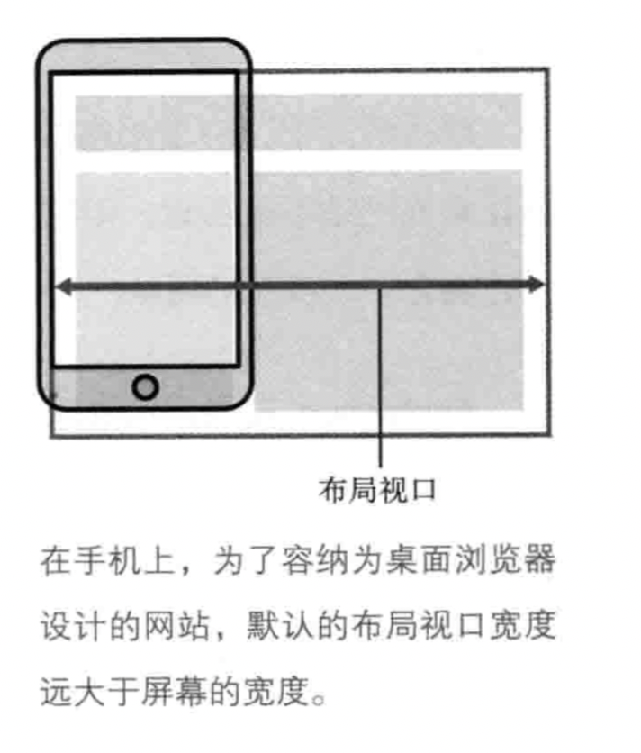

# 移动端适配解决方案

## Why：为什么要做屏幕适配

在前端开发页面之前，视觉会给我们需要开发成页面的视觉稿。视觉稿有的事psd文件，也有的是使用Sketch Measure生成的带标注的视觉稿html文件。

对于移动端的H5页面，为了页面达到高清的效果，视觉稿的规范往往会遵循以下两点：

1. 首先，选取一款手机的屏幕宽高作为基准(以前是iphone4的320×480，现在更多的是iphone6的375×667)。
2. 对于retina屏幕(如: dpr=2)，为了达到高清效果，视觉稿的画布大小会是基准的2倍，也就是说像素点个数是原来的4倍（对iphone6而言：原先的375×667，就会变成750×1334）。也就是说你看到的标注信息是：基准尺寸大小 * dpr。

对于前端来说，如果不做任何处理或适配，按照视觉稿给的数值进行开发，那么展现的内容就会有问题。比如说对于iphone6对应的视觉稿的一个‘10px’的线，它其实是物理像素值，需要除以2（dpr对应的值）来得到对应的css像素值。这种方式需要开发人员自己去计算。

## How：如何做屏幕适配

那么接着上面的来说，对于dpr=2的手机，为什么画布大小×2，就可以解决高清问题？这里首先要讲一些基本概念。

### 一些基本概念

#### 物理像素(physical pixel)

一个物理像素是显示器(手机屏幕)上最小的物理显示单元，在操作系统的调度下，每一个设备像素都有自己的颜色值和亮度值。

#### 设备独立像素(density-independent pixel)

设备独立像素(也叫密度无关像素)，可以认为是计算机坐标系统中得一个点，这个点代表一个可以由程序使用的虚拟像素(比如: css像素)，然后由相关系统转换为物理像素。

所以说物理像素和设备独立像素之间存在着一定的对应关系而未必是 `1:1` 对应，这就是接下来要说的设备像素比。

#### 设备像素比(device pixel ratio )

设备像素比(简称dpr)定义了物理像素和设备独立像素的对应关系，它的值可以按如下的公式的得到：

```
设备像素比 = 物理像素 / 设备独立像素 // 在某一方向上，x方向或者y方向
```

#### 不同分辨率屏幕1个CSS像素对应的物理像素

* 在普通屏幕下（dpr=1），1个css像素 对应 1个物理像素(1:1)。
* 在retina 屏幕下（dpr=2），1个css像素对应 4个物理像素(1:4)。

### 在前端中能做什么？

在javascript中，可以通过`window.devicePixelRatio`获取到当前设备的dpr。

在css中，可以通过`-webkit-device-pixel-ratio`，`-webkit-min-device-pixel-ratio`和 `-webkit-max-device-pixel-ratio`进行媒体查询，对不同dpr的设备，做一些样式适配(这里只针对webkit内核的浏览器和webview)。


## What：适配方案以何种形式被使用

## Done：具体实现

## 参考

https://segmentfault.com/a/1190000006837963
https://github.com/ant-design/ant-design-mobile/wiki/viewport

## note

### 移动web手册

#### 什么是像素

*一个像素就是指计算机屏幕能显示一种特定颜色的**最小**区域*。

#### 为什么有些设备的屏幕看起来就很高清（什么叫高清）？

屏幕上的像素越多，同一时间你可以看到的越多。当设备尺寸相同的时候，但像素变得更密集的时候，屏幕能显示的画面的过渡更细致，网站看起来更明快。这也就是屏幕高清的原因。

#### `width: 200px`

当给一个元素设置了`width: 200px;` 是不是意味着这个元素有200个’像素‘呢？这里要说一下关于像素，实际上有两种’像素‘：

1. 设备像素：设备屏幕的物理像素，任何设备的物理像素的数量都是固定的。
2. CSS像素（设备无关像素）：为web开发人员创造的，在CSS（JavaScript）中使用的一个抽象层。（或者理解为专门为开发用的统一的像素系统）。

所以对于`width: 200px`来说，它代表着这个元素跨域了200个CSS像素，至于这200个CSS像素跨越了多少个设备像素（或者说相当于多少个设备像素）取决于**屏幕的特性**和**用户是否进行了缩放操作**。

而对于用户缩放操作，当用户放大得越大的时候，一个CSS像素覆盖的设备像素就越多。因此这个元素跨越的设备像素一定大于200这个数量。

对于屏幕特性这一点，苹果的视网膜屏幕的**像素密度**是普通屏幕的两倍。那么200个CSS像素就相当于400个设备像素。

我们平时开发中（无论是使用CSS还是JavaScript）使用的都是CSS像素，这样方便于我们进行开发和调试。所以基本上涉及不到设备像素。

*唯一的例外是`screen.width / heigth`，不过这是他自己的问题*

#### 视口的存在

接下来，我们换一个问题。我们将我们的元素设置为`width: 35%`，那么会发生什么呢？我想你会回答是“浏览器窗口的35%”。但是为什么呢？

首先回顾一下一个CSS宽度百分比在CSS中代表着什么？**一个CSS宽度的百分比都是根据其父元素的宽度来计算的。对于一个块级元素在CSS没有声明任何宽度的时候，其宽度默认为100%，也就是其父元素的宽度的100%。**

然后对于下面的CSS样式：

``` css
html, body {
    // 没有任何宽度声明
}

div.sidebar {
    width: 35%;
}
```

由于我们的`div.sidebar`占用了它的包含块body宽度的35%，body没有显示声明宽度大小，因此它占用了它的父包含块html元素的宽度100%。同样的，html元素也没有显示声明宽度大小，因此它也占用了父包含块宽度的100%。

那么问题来了，html元素的包含块是什么？它叫做视口（viewport），在CSS标准文档中，他叫做**初始包含块**。

那么实际上视口不止是一个，一共有三种视口。

#### 布局视口（layout viewport）

简单的来说，布局视口就是我们实际进行元素布局的“画布”。我们使用CSS像素设置元素大小、布局等操作都是在该视图上进行的。也就是说CSS布局会根据它来计算，并被它约束。（它可以不全部在设备像素区域内，所以它会像下面这样，默认的宽度一般为980px，不同浏览器实现可能会不同）



*如果从实际开发角度来说，布局视口就是iphone6的375 * 667、iphone6 plus的414 * 736。如果不考虑缩放，那么就是document.documentElement.clientWidth/clientHeight。这个稍后会详细说到。*

#### 视觉视口（visual viewport）

简单的来说，视觉视口就用户能看得见的区域。用户可以通过缩放来操作视觉视口，同时不影响布局视口，布局视口仍然保持在原来宽度。通常情况下，视觉视口对于开发者来说没那么重要，但是我们依然可以通过JavaScript手段来获取数据，从而可以了解到用户正在观察网站的哪部分。


#### 理想视口（ideal viewport）

如果我们只有上面两种视口，那么我们在移动端的网站不能称得上是真正的移动端网站。因为在移动端狭窄的屏幕上更适合一个狭窄的网站。所以布局视口的默认宽度不是一个理想的宽度。所以这就是为什么苹果引进了**理想视口**并且其他浏览器厂商效仿的原因。

*理想视口就是指对于设备来说最理想的布局视口尺寸。*

显示在理想视口里的网站拥有最理想的阅读和浏览的宽度，用户无需进行缩放操作。而默认情况下，理想视口是不会产生影响的，只有我们主动的网页里添加`meta`标签才会生效。如果没有`meta`标签声明视口，那么布局视口将维持它的默认宽度。

``` html
<meta name="device" content="width: device-width">
```

这一行告诉了浏览器布局视口的宽度与理想视口的宽度相同。

#### 关于缩放

*缩放是放大或者缩小CSS像素的过程*

1. 缩放程度和视觉视口的大小是逆相关的：放的越大，视觉视口越小。
2. 桌面和手机的一个重大区别的是：**在手机上布局视口不会被缩放影响，但在桌面上会，因为桌面上的视觉视口的大小和布局视口相同，不可能在改变其中一个视口的时候不改变另一个。（这个我感觉最好的理解是，先理解下面的拖放，然后反向证明桌面缩放的过程。）**
3. 在移动端进行”缩放“其实是在做**拖放**的动作，跟页面缩放有本质区别。移动端的缩放不会导致CSS布局被重新计算。

#### 最大缩放和最小缩放

最大缩放和最小缩放基于的是理想视口的大小。

#### 分辨率

##### 物理分辨率

用像素的数量除以屏幕以英寸为单位的宽度可以得到你的设备每英寸的点数，简称DPI。每英寸内的像素点数越多越好，画面越清晰。

web开发中没办法知道物理分辨率，因为没办法获得这个信息。

##### 设备像素比

JavaScript有一个`window.devicePixelRatio`，CSS也有 `device-pixel-ratio`和分辨率的媒体查询，但是他们都与物理分辨率无关。取而代之的是提供了设备像素个数和理想视口的比，成为设备像素比，简称DPR。

##### dppx和dpi

JavaScript中`window.devicePixelRatio`和CSS中`device-pixel-ratio`的单位都是`dppx`，即每个像素的点数。但实际上是不允许后面加单位的。

然而分辨率的媒体查询是需要单位的，虽然大多数浏览器支持，但是IE11以及一下的版本不支持dppx，所以我们必须使用dpi来代替。因为一英寸对应了CSS中的96个像素，所以`1dppx == 96dpi`。也就是需要用转换后的dpi来表示dppx。为了使用媒体查询支持所有浏览器，我们必须这么做：

``` css
@media all and ((-webkit-min-device-pixel-ratio: 2),
(min-resolution: 192dpi)) {

}
```

**所以不要误以为物理像素与dpi有关**。

#### meta视口标签

格式：`<meta name="viewport" content="name=value, name=value">`

一般有五个key value：

* width：设置布局视口的宽度为特定值。
* init-scale：设置页面的初始缩放程度和布局视口的宽度。
* minimum-scale：设置了最小缩放程度（用户可缩小程度）。
* maximum-scale：设置了最大缩放程度（用户可放大程度）。
* user-scalable：是否阻止用户缩放。

##### width

##### aspect-ratio和device-aspect-ratio

aspect-ratio和device-aspect-ratio分别提供了布局视口的宽高比和`screen.width/height`的值。这个比例是用一个分数表示的。例如：3/4或16/9。（css媒体查询属性）

##### 布局视口

获取布局视口的方式通过：

``` js
document.documentElement.clientWidth/Height
```

##### 视觉视口

获取视觉视口的方式通过：

``` js
window.innerWidth/Height
```

但不是所有的浏览器都支持。最严重的问题出现在安卓webkit2和代理浏览器上。幸运的是，你并不会经常需要知道视觉视口的尺寸。

##### 理想视口————还是屏幕尺寸

对于理想视口，我们可以通过`screen.width/height`来获取，但是它有很严重的兼容性问题。

对于 `screen.width/height`，根据浏览器情况，这可能是两种值：

1. 理想视口的尺寸
2. 屏幕的设备像素尺寸

这意味着在实践中你不能使用`screen.width/height`，因为你永远不知道你获得的是什么值。

*记住，device-width和device-height媒体查询使用了javascript提供的screen.width/height，不用管浏览器使用的是哪个定义。*

##### devicePixelRatio

它没有单位，提供了屏幕的物理尺寸和理想视口的比例。device-pixel-ratio媒体查询使用了同样的值。

##### 改变meta视口标签

在大多数浏览器中，我们可以改变meta视口标签。假设meta视口是你的文档中的第一个meta标签，像下面这么做：

``` js
var meta = document.getElementsByTagName('meta')[0];
meta.setAttribute('content', 'width=400');
```

*注意：我们无法通过移除meta标签来使布局视口变回它默认的宽度。但是，你可以把它设为一个固定的值，例如，如果你想提供“切换到桌面布局”的功能，可以把宽度设置为980px或1024px。*

##### orientationchange事件

在所有的webkit和基于Blink的浏览器中，只要用户改变了设备的方向，`orientationchange`事件就会被触发。其中IE11和Firefox31都不支持它。

当事件发生时候，可以通过`window.orientation`（数值类型）得到此时的状况：

* 0代表竖屏
* 90代表由竖屏逆时针旋转到横屏
* -90代表由竖屏顺时针旋转到横屏
* 还有一个是180，表示竖屏但是是翻转过来的竖屏模式。但这种模式至今尚未得到支持。

https://blog.csdn.net/gong1422425666/article/details/79001836

##### resize事件

当视口尺寸大小改变的时候，就会触发`resize`事件。那是指哪一个视口呢？毫无疑问，浏览器在这个问题上没有达成一致。

*一个问题：如果我们将设备旋转了180度，orientationchange事件是否应该触发呢？一方面，设备旋转了，另一方面，最终的方向跟最初的是一样的：你从竖屏切换到竖屏或从横屏切换到横屏，浏览器会有不同的对策。(经测试，iphone手机浏览器上是不会触发resize事件)*

一般来说，理想视口的尺寸是不会被改变的。那么剩下的布局视口和视觉视口。大部分浏览器都会在布局视口的尺寸改变的时候触发`resize`事件，而在视觉视口尺寸改变时（就是用户缩放时）不会触发。这个规则不是绝对的。

让事情变复杂的是，有很多改变布局视口或视觉视口尺寸的方法，但并不是所有方法都会触发resize事情。为了让事情变得复杂一点，Safari会在并不是视口的html元素增加或删减内容的时候触发`resize`事件。这绝对是不应该发生的。

**所以最好不要轻信resize事件**